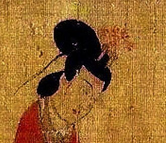

# Huadian

<div align="center">
    <h1>Rustphish</h1>
    
    
    
    <br>
    <br>
    
</div>

Huadian(花钿)是由我本人开发并维护的博客框架，基于Astro、Svelte和Nodejs。

# Features
- 强大的Markdown渲染：支持所有常见语法及`mermaid`流程图
- 结构清晰的博客架构：支持Sitemap、tag、series等检索功能
- 简洁干净的风格：基于[ThoughtLite](https://github.com/tuyuritio/astro-theme-thought-lite)的美观的网页风格
- 高性能的框架：基于Astro的SSG功能和JS懒加载机制的高性能框架
- Light/Dark模式支持：完整的支持，包括代码块和流程图的亮暗色切换

# Quickstart

```bash
git clone https://github.com/Ky9oss/Huadian
cd Huadian
npm install
npm run build
npx playwright install --with-deps chromium
HOST=0.0.0.0 PORT=4321 node ./dist/server/entry.mjs
```

# Acknowledgments
[ThoughtLite](https://github.com/tuyuritio/astro-theme-thought-lite)
