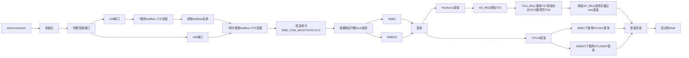

# 代码块

```lua
print('hello world')
```

下面是分割线

---

```astro
<script>
	import zoom from "medium-zoom/dist/pure";

	window.zoom = () => zoom(".markdown img", { background: "#00000044" });
	window.zoom();

	document.addEventListener("astro:page-load", () => {
		window.zoom();
	});
</script>

```

## 二级标题

### 三级标题

#### 四级标题

# 序列

- 123
- qwerttyuiop
- 信息展示你好朋友

蜻蜓队长：
1. 绝对不意气用事
2. 绝对不漏抓任何一件坏事
3. 绝对裁判得公正漂亮，裁判机器人蜻蜓队长前来晋见！

# 表格
| id | plugins        | description    |
|----|----------------|----------------|
| 1  | vim-table-mode | 用它写表格得劲 |
| 2  | telescope      | 各种快速检索   |
| 3  | mirage.nvim    | 没啥用         |


# 文字样式

**加粗**

*斜体*

~~删除~~

==下划线==

普通链接：https://baidu.com

[超链接](https://baidu.com)


> [!TIP]
> 
> 123

> [!IMPORTANT]
> 
> 123

> [!CAUTION]
> 
> 123

> [!WARNING]
> 
> 123

> [!NOTE]
> Hello

> NOTION
> 
> 333
> 444

# 流程图




